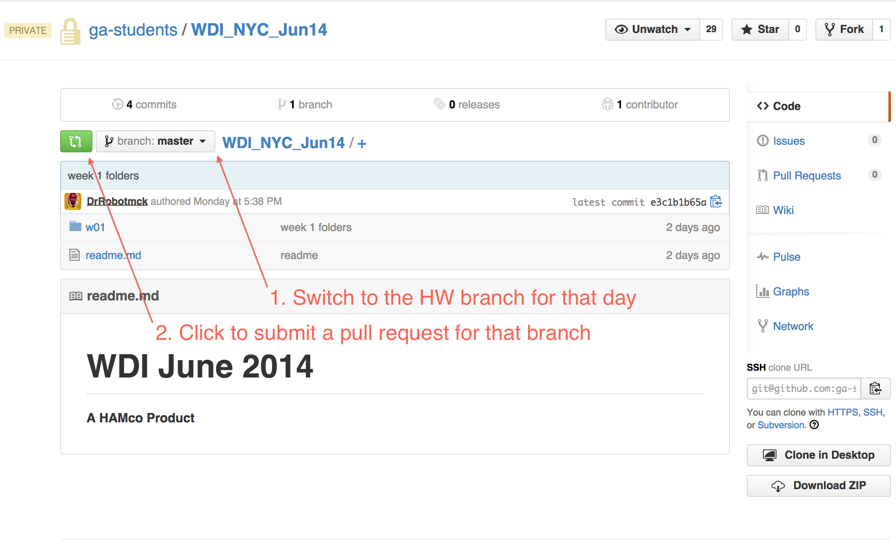

# Submitting Homework

**ALL ASSIGNMENTS MUST BE SUBMITTED BY MIDNIGHT**
- If you have not yet finished the assignment it is OK.
- You can keep working on the assignment but a Pull Request must be submitted by **midnight**

## Step 1 - Getting the assignment

- Open a new terminal window or tab
- cd into the class repo folder on your computer


```
cd ~/wdi/WDI_NYC_Jun14
```
**Make sure you are on your _master_ branch**
- Pull from upstream master
- You may need to close a merge/commit message.

```
git checkout master
git branch
git pull upstream master
```

## Step 2 - Setting up your workspace

- cd into the `ASSIGNMENT_FILES` folder for that week and day
- copy the files into _YOUR_ day folder
- checkout a new branch for that day's assignment

```
cd w01
cd d01
cd ASSIGNMENT_FILES

cp . ../YOUR_NAME_FOLDER

git checkout -b hw_w01_d01
git branch
```

**Make sure that you are in YOUR folder before beginning the assignment**

## Step 3 - Submitting the assignment

- Save all of the files that you worked on for the assignment
- Stage your changes

```
git status
git add .
git status
```
- Commit your changes and push your branch to Github

```
git commit -m "Completed Assignment"
git push origin hw_w01_d01
```

## Submitting a Pull Request

- Go to YOUR fork of the class repo on Github
- Switch to the HW branch for that day
- Click the green icon next to the branch name



- Your pull request should be submitted for your HW branch to upstream master `ga-students:master`
- Your pull request **MUST** be titled like so `Homework 01-01`
- You **MUST** include comments on your comfortability with and completeness of the assignment in the comments section of your pull request
  - This should be on a scale of 1-5 (5 being the highest)
  - If you have any questions about the assignment or any concepts covered on the assignment they can be optionally added

```
{
  "comfortability": 4,
  "completeness": 5,
  "questions": "What is the difference between map and each?"
}
```

## Final Steps

- Make sure you have filled in the title and comments section appropriately before you submit the pull request then ...

###Get some rest!!! Relax, review, and prepare yourself for the next day of class
