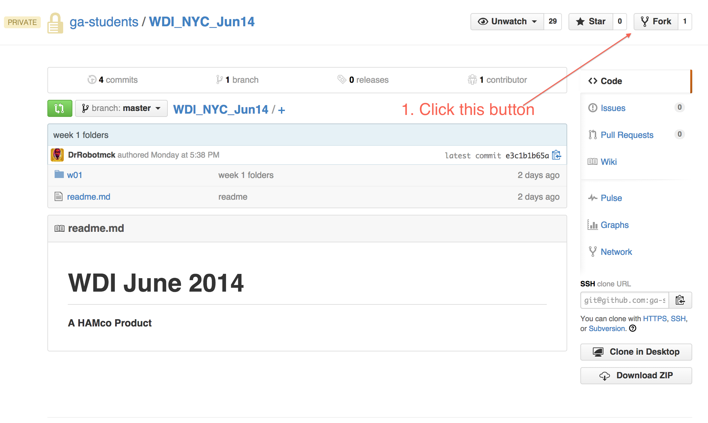
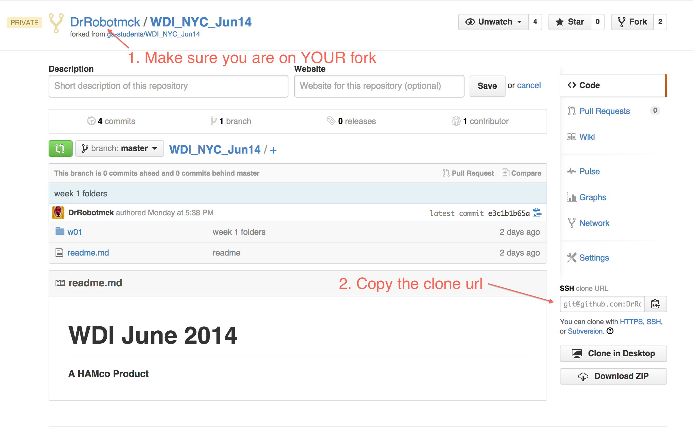

# Setting up your Remote (github) and Local (local machine) repositories

## Forking the repo

* Make sure you have your [ssh keys set up](https://help.github.com/articles/generating-ssh-keys)
* You should then start by forking the main class repository



* Copy the clone url for YOUR fork



* Open a new terminal window and cd into your `/wdi` directory and clone your fork

```bash
cd ~/wdi
git clone YOUR_CLONE_URL
```
For example mine would look like this:

```bash
git clone git@github.com:DrRobotmck/WDI_NYC_Jun14.git
```

* cd into your `WDI_NYC_Jun14` directory and verify that you have added the origin remote for your fork

```bash
$ cd WDI_NYC_Jun14
$ git remote -v
origin	git@github.com:DrRobotmck/WDI_NYC_Jun14.git (fetch)
origin	git@github.com:DrRobotmck/WDI_NYC_Jun14.git (push)
```
## Add a remote for the main class repo

* Add a remote for our main repository as "upstream" and verify that it was added

```bash
$ git remote add upstream git@github.com:ga-students/WDI_NYC_Jun14.git
$ git remote -v
origin	git@github.com:DrRobotmck/WDI_NYC_Jun14.git (fetch)
origin	git@github.com:DrRobotmck/WDI_NYC_Jun14.git (push)
upstream  git@github.com:ga-students/WDI_NYC_Jun14.git (fetch)
upstream  git@github.com:ga-students/WDI_NYC_Jun14.git (push)
```

#### Your repo is set up and you are ready to use it to get files from us and also submit homework.

## How Do I Get Files From GitHub?

Periodically, we will be posting new assignments and exercises. To get these files you have to __pull__ them from the main repository at __upstream__

* cd into your class repo directory and make sure that you are on the master branch
* once you are in the appropriate directory you can pull from upstream
  * this will pull down any changes to the main repository to your local repository

```bash
cd ~/wdi/WDI_NYC_Jun14
git checkout master
git pull upstream master
```
